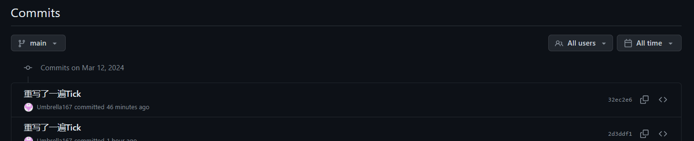
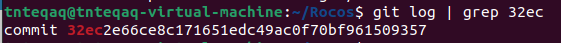

## 怎么提交

1. 每次写代码前先拉去最新的版本。

    ```bash
    git pull
    ```

2. 然后新建一个分支。

    ```bash
    // 新建分支
    git branch <branchname>
    // 切换到该分支
    git checkout <branchname>
    // 查看当前所处分支
    git branch
    ```

3. 然后在这个分支下编写代码。

    ```bash
    // 正常提交版本
    git add .
    git commit -m "xxx"
    // 将该分支提交到远程仓库
    git push origin <branchname>
    //合并就交给yyh了（
    ```

4. 想要往线上仓库推代码时。
	
	
	先确认线上仓库里的**最新提交**是否在自己过去的提交里
	
	
	线上代码**最新**的提交是`32ec2e66ce8c171651edc49ac0f70bf961509357`。
	
   查看本地提交是否**包含**线上最新的提交。
   
   ```bash
     git log | grep <版本前几位（基本上四到五位就行）>
     // 例:
     git log | grep 32ec
   ```
   
   1. 有回显
      
      说明线上提交和本地的仍处于同一分支内。
      这时候可以自己合并一下提交。
      
      ```bash
      // 切换到main分支
      git checkout main
      // 合并分支
      git merge <branchname>
      // 提交代码
      git push
      ```
      
   2. 无回显
      说明不是同一个版本，直接提交该分支。
   
      ```bash
      git push origin <branchname>
      ```
   
      合并就先交给yyh。
   
5. 删除分支

    ```bash
    // 会询问是否合并
    git branch -d <branchname>
    // 强制删除
    git branch -D <branchname>
    // 从远程代码删除分支
    git push origin --delete <branchname>
    ```

    
